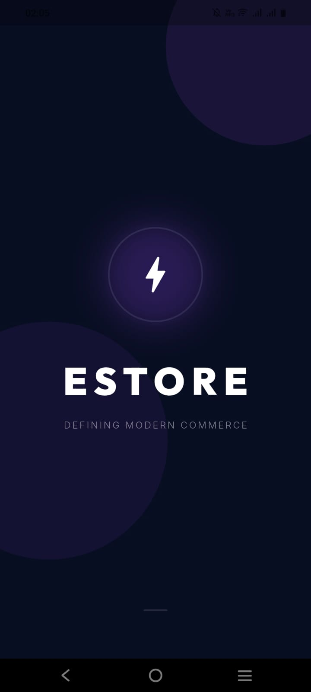
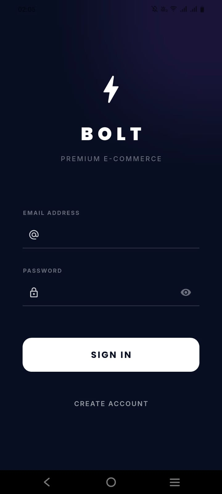
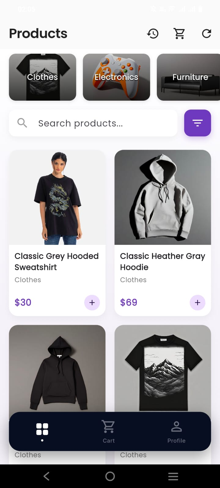
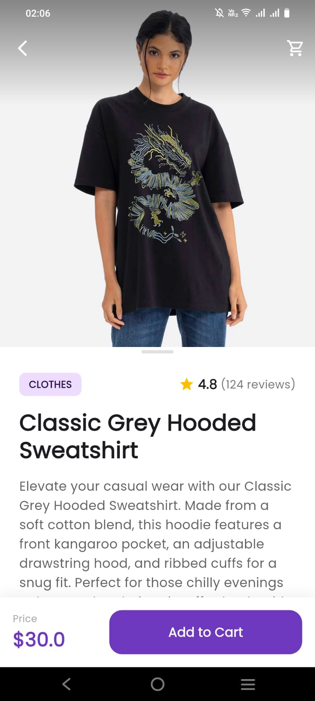
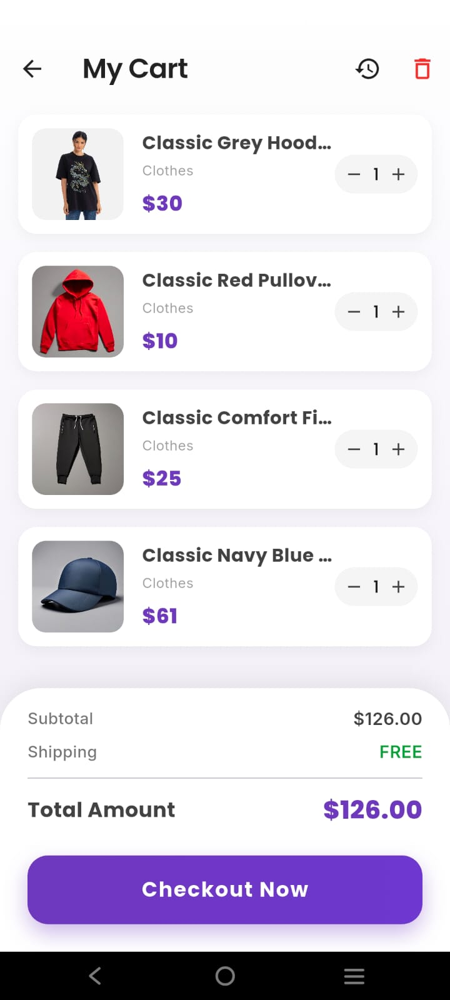

# ⚡ BOLT - Premium E-Commerce App

<div align="center">


**A state-of-the-art Flutter e-commerce application built with Clean Architecture, Riverpod, and Cinematic UI/UX.**

[Features](#-key-features) • [Visuals](#-visuals) • [Tech Stack](#-tech-stack) • [Getting Started](#-getting-started)

</div>

---

## ✨ Key Features

- **🎬 Cinematic UI/UX**: Custom-animated splash screens and glassmorphism-inspired minimalist login for a premium first impression.
- **🏗️ Clean Architecture**: Highly maintainable and testable codebase divided into Data, Domain, and Presentation layers.
- **🔋 Persistent State**: Robust state management using **Riverpod**, ensuring real-time updates across the app.
- **📦 Offline Storage**: Local data persistence using **SQLite** for smooth performance even without an active connection.
- **💳 Payment Integration**: Fully functional **Razorpay** integration for secure and effortless checkouts.
- **📱 Floating Dashboard**: An aesthetic, high-contrast floating bottom navigation bar with real-time cart badges.
- **🔐 Secure Auth**: JWT-based authentication with `flutter_secure_storage` for persistent user sessions.

## 📸 Visuals

| Splash & Experience | Premium Login | Floating Dashboard |
| :---: | :---: | :---: |
|  |  |  |

| Product Exploration | Smart Shopping Cart | Secure Payment |
| :---: | :---: | :---: |
|  |  |  |

## 🛠️ Tech Stack

- **Framework**: [Flutter](https://flutter.dev/)
- **State Management**: [Flutter Riverpod](https://riverpod.dev/)
- **Local DB**: [sqflite](https://pub.dev/packages/sqflite)
- **API Connectivity**: [http](https://pub.dev/packages/http)
- **Image Caching**: [cached_network_image](https://pub.dev/packages/cached_network_image)
- **Typography**: [Google Fonts](https://pub.dev/packages/google_fonts)
- **Payment Gateway**: [Razorpay Flutter](https://pub.dev/packages/razorpay_flutter)

## 🚀 Getting Started

### Prerequisites

- **Flutter SDK**: `3.38.3` (Stable channel)
- **Dart SDK**: `3.10.1`
- **Android Studio / VS Code**
- **Git**

### Installation

1. **Clone the repository**:
   ```bash
   git clone https://github.com/YOUR_GITHUB_USERNAME/bolt-ecommerce-flutter-clean.git
   ```

2. **Navigate to the project directory**:
   ```bash
   cd bolt-ecommerce-flutter-clean
   ```

3. **Install dependencies**:
   ```bash
   flutter pub get
   ```

4. **Run the app**:
   ```bash
   flutter run
   ```

## 🌐 API & Testing

BOLT uses the [Platzi Fake Store API](https://api.escuelajs.co/docs#/) for data integration and authentication testing.

### Test Credentials
You can use the following credentials to test the login functionality:

| Email | Password | Role |
| :--- | :--- | :--- |
| `admin@mail.com` | `admin123` | Admin |

### Environment Setup
The project uses `flutter_dotenv` to manage environment variables. Ensure you have a `.env` file in the root directory:

```env
API_BASE_URL=https://api.escuelajs.co/api/v1
# Add other keys as required
```

## 📂 Architecture Overview

The project follows a modular Clean Architecture pattern:

- **Core**: Contains shared utilities, exceptions, and base themes.
- **Features**:
  - **Auth**: Remote login, profile fetching, and token persistence.
  - **Products**: Catalog browsing, category filtering, and product details.
  - **Cart**: Global cart state with local persistence.
  - **Payment**: Payment processing and transaction history.

## 🤝 Contributing

Contributions are welcome! Whether it's fixing a bug, improving documentation, or adding new features, your help is appreciated. Please read the [contributing guide](CONTRIBUTING.md) to get started.

---

*Built with ❤️ by [Jithin](https://github.com/jithinc29)*
